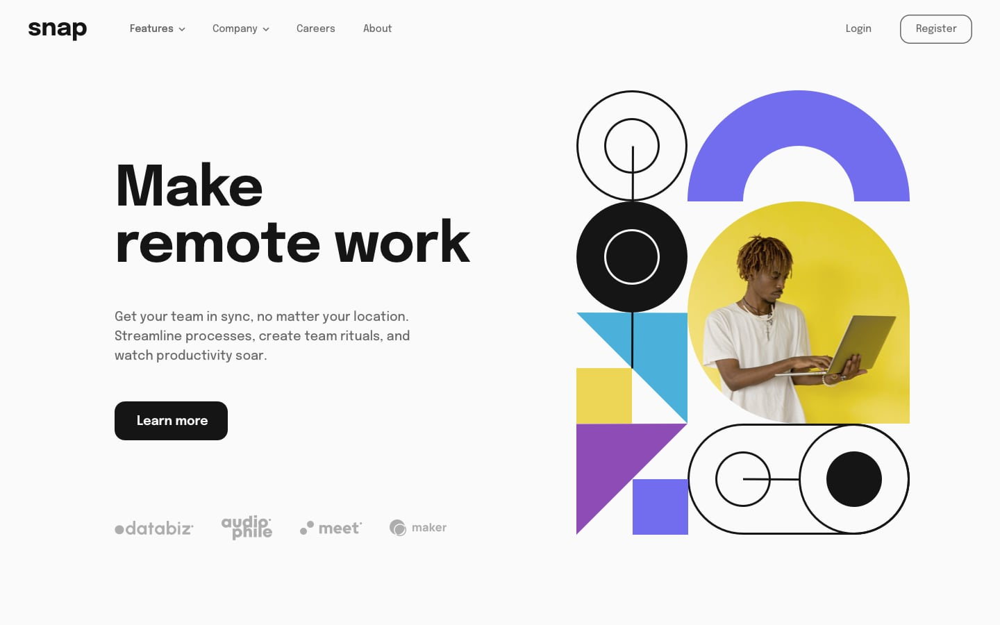
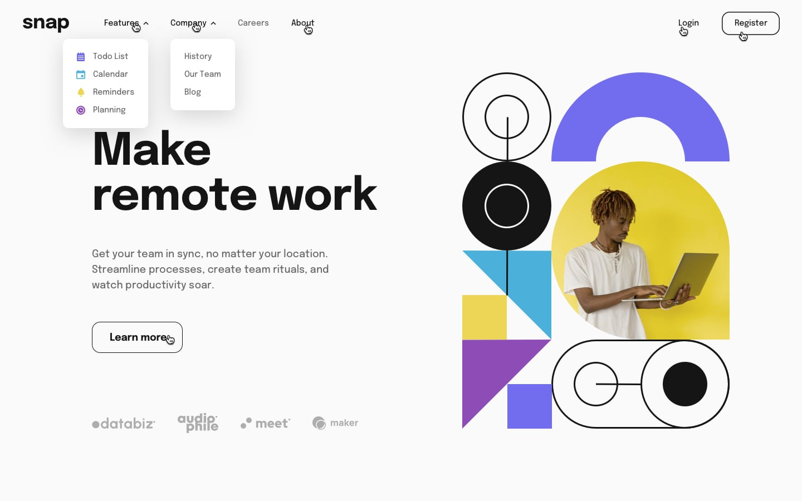
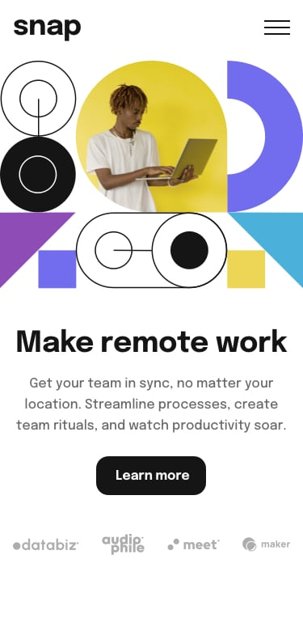
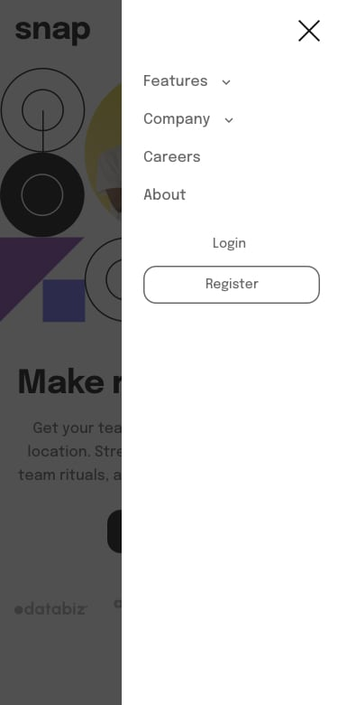
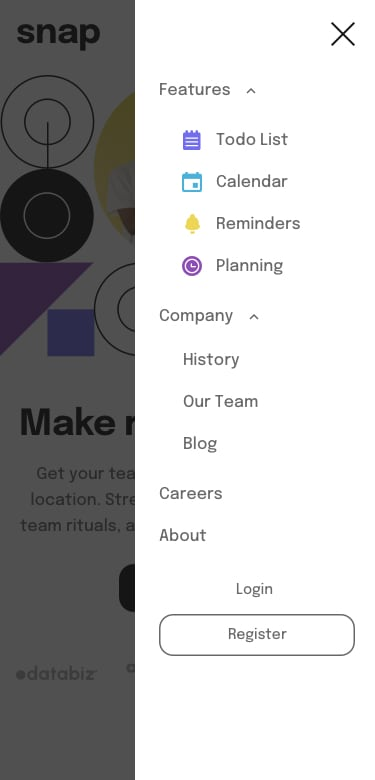

# Frontend Mentor - Intro Section with Dropdown Navigation Solution

Esta es mi solución al reto **Intro Section with Dropdown Navigation** de Frontend Mentor. Este proyecto se enfoca en construir una landing page responsive con menús de navegación desplegables interactivos para móvil y escritorio utilizando HTML, CSS y JavaScript puro (vanilla JavaScript).

El reto fue una gran oportunidad para practicar estructura semántica en HTML, arquitectura moderna de CSS, técnicas de diseño responsive y manipulación del DOM sin depender de frameworks o librerías externas.

---

## Tabla de contenidos
- [Resumen](#resumen)
- [El reto](#el-reto)
- [Diseño](#diseño)
- [Enlaces](#enlaces)
- [Mi proceso](#mi-proceso)
- [Tecnologías utilizadas](#tecnologías-utilizadas)
- [Lo que aprendí](#lo-que-aprendí)

---

## Resumen
Este proyecto es una landing page responsive que incluye un sistema de navegación interactivo con menús desplegables tanto para la versión móvil como para la versión de escritorio.

La interfaz incluye un menú móvil deslizante, elementos de navegación con dropdown, cambio dinámico de iconos y un efecto de overlay cuando el menú móvil está activo. El layout se adapta a diferentes tamaños de pantalla utilizando un enfoque **mobile-first**.

Todo el estilo del layout se maneja con técnicas modernas de CSS, mientras que el comportamiento interactivo de la navegación se implementa utilizando **JavaScript vanilla** mediante manipulación del DOM y event listeners.

---

## El reto
Los usuarios deberían poder:

- Ver el layout óptimo dependiendo del tamaño de pantalla de su dispositivo.
- Experimentar un diseño responsive con enfoque **mobile-first**.
- Abrir y cerrar el menú de navegación móvil.
- Alternar submenús desplegables en la navegación móvil y de escritorio.
- Ver cómo los iconos de flecha cambian según el estado del submenú.
- Cerrar los menús al hacer clic fuera de ellos.
- Ver estados **hover** y **focus** en los elementos interactivos.
- Experimentar transiciones suaves entre los diferentes estados de la interfaz.

---

## Diseño

- Diseño Desktop  

- Estados Activos  

- Diseño Mobile  

- Menú Mobile Colapsado

- Menú Mobile Expandido 

---

## Enlaces
- URL de la solución: [Repositorio en GitHub](https://github.com/mlopezl/Intro-seccion-with-dropdown-navigation)
- URL del sitio en vivo: [Demo en vivo](https://mlopezl.github.io/Intro-seccion-with-dropdown-navigation/)

---

## Mi proceso
- Estructuré el layout utilizando elementos **semánticos de HTML5** como `header`, `nav`, `main` y `section`.
- Seguí un enfoque **mobile-first**, mejorando progresivamente el layout mediante media queries.
- Construí los layouts principalmente utilizando **Flexbox** para alineación, espaciado y estructura responsive.
- Utilicé **CSS custom properties (variables)** para crear un sistema de colores consistente.
- Apliqué la **metodología BEM** para mantener un CSS modular, escalable y fácil de leer.
- Implementé menús de navegación desplegables tanto para la interfaz móvil como para la de escritorio.
- Creé un panel de navegación móvil deslizante con un fondo overlay.
- Utilicé **manipulación del DOM con JavaScript** para alternar dinámicamente la visibilidad de los menús.
- Gestioné los estados de la interfaz agregando y eliminando clases CSS como `hidden`.
- Implementé el cambio de iconos de flechas dependiendo del estado del submenú.
- Añadí un event listener global para detectar clics fuera de la navegación y cerrar los menús abiertos.
- Mantuve una clara separación entre estructura (HTML), estilos (CSS) y lógica (JavaScript).

---

## Tecnologías utilizadas
- HTML5
- CSS3
- JavaScript (ES6)
- Flexbox
- CSS custom properties (variables)
- Flujo de trabajo **mobile-first**
- Principios de **responsive design**
- Metodología de nombres **BEM**
- Manipulación del DOM
- Event listeners
- Media queries

---

## Lo que aprendí
- Estructurar layouts responsive utilizando **HTML semántico**.
- Construir layouts flexibles usando **Flexbox**.
- Organizar estilos escalables utilizando la **metodología BEM**.
- Crear tokens de diseño reutilizables utilizando **variables CSS**.
- Implementar sistemas de navegación con dropdown utilizando **JavaScript vanilla**.
- Gestionar estados de la interfaz agregando y eliminando clases dinámicamente.
- Detectar clics fuera de los elementos para mejorar la experiencia de usuario.
- Implementar menús móviles con efectos de overlay.
- Manejar el diseño responsive utilizando **media queries** y ajustes de layout.
- Escribir código frontend limpio, mantenible y sin usar frameworks.